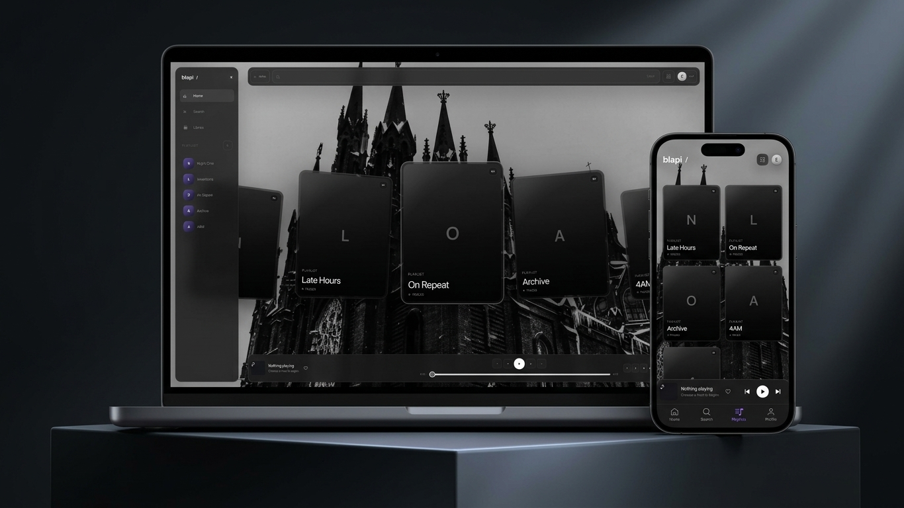

# b1api


A cinematic local-first music web application powered by YouTube Data API v3 and the official YouTube IFrame Player. Combines a full-screen visual experience with playlists, playback controls, search, and browser-local music preferences.

## Live Demo
 [b-1-o.github.io/music](https://b-1-o.github.io/music/)




## Features
- YouTube Data API v3 search
- Official YouTube IFrame Player
- Local playlists, likes, and recently played history
- Queue, shuffle, and repeat
- Custom background and glass/blur settings
- Local nickname-based experience
- Touch and mouse navigation
- GitHub Pages deployment via GitHub Actions

## Tech Stack
JavaScript · HTML · CSS · YouTube Data API v3 · YouTube IFrame Player · GitHub Actions · GitHub Pages

## How it works
- Search queries are sent to YouTube Data API v3; results are rendered as playable cards.
- Playback uses the official YouTube IFrame Player API for reliability and compliance.
- All user data (playlists, likes, history, appearance, nickname) is stored in localStorage — nothing is sent to a server.
- The app is a static site deployed to GitHub Pages; the API key is injected at build time via GitHub Actions secrets.

## Getting Started
```bash
git clone https://github.com/b-1-o/music.git
cd music
```
